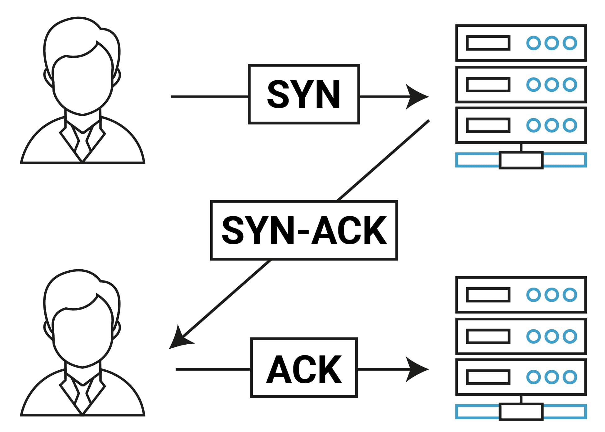

# Three Way Handshake

## Pengertian

Three way handshake adalah metode yang digunakan dalam jaringan TCP/IP untuk membuat koneksi antara host/client lokal dan server.

## Tahapan Three Way Handshake

Semua langkah dibawah ini diperlukan untuk memverifikasi nomor seri yang berasal dari kedua belah pihak, menjamin stabilitas koneksi. Karena kedua host harus mengetahui parameter koneksi pihak lain, segmen yang hilang atau rusak dapat dideteksi dengan cepat sebelum proses transfer data sebenarnya dimulai.

### 1. Permintaan Membuat Koneksi (SYN)

Diawali dengan client mengirimkan node koneksi yang memiliki flag SYN (synchronize) yang telah diatur. Paket SYN ini adalah nomor urut acak yang ingin digunakan client untuk komunikasi (misalnya X). Tujuan dari paket ini adalah untuk menanyakan/menyimpulkan apakah server terbuka untuk koneksi baru.

Flag SYN ini menunjukkan bahwa client ingin membuka koneksi dengan penerima. Nomor urutan (sequence number) juga diatur dalam segmen ini. Nomor urutan ini akan digunakan untuk mengidentifikasi data yang dikirimkan dalam koneksi ini.

### 2. Server Membalas Koneksi (SYN-ACK)

Ketika server menerima paket SYN dari node client, server merespons dan mengembalikan tanda terima konfirmasi – paket ACK (Acknowledgement Sequence Number) atau paket SYN/ACK. Paket ini mencakup dua nomor urut.

Yang pertama adalah ACK satu, yang diatur oleh server menjadi satu lebih dari nomor urut yang diterima dari client (misalnya X+1). Yang kedua adalah SYN yang dikirim oleh server, yang merupakan nomor urut acak lainnya (misalnya Y).

Urutan ini menunjukkan bahwa server mengakui paket client dengan benar, dan server mengirimkan paketnya sendiri untuk diakui juga.

### 3. Konfirmasi Koneksi (ACK)

Node client menerima SYN/ACK dari server dan merespons dengan paket ACK. Masing-masing pihak harus mengakui nomor urut yang diterima dengan menambahnya satu.

Client kemudian mengirimkan segmen dengan flag ACK yang diatur sebagai konfirmasi bahwa segmen SYN-ACK penerima telah diterima. Pengirim juga mengatur nomor urutan acknowledgment (nomor urutan + 1 dari segmen SYN-ACK penerima) untuk mengkonfirmasi bahwa segmen SYN-ACK penerima telah diterima.

Setelah menyelesaikan proses ini, koneksi dibuat dan host serta server dapat berkomunikasi.